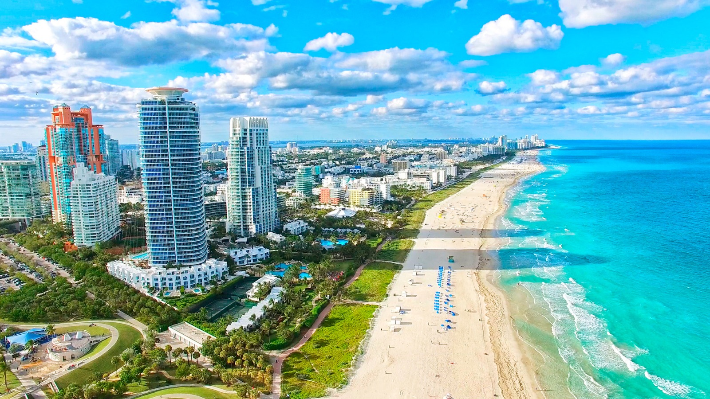

<html>
    <head>
        <meta charset="UTF-8">
    <meta name="viewport" content="width=device-width, initial-scale=1.0">
        <link rel="stylesheet" href="style.css.css">
        <link href='https://unpkg.com/boxicons@2.1.4/css/boxicons.min.css' rel='stylesheet'>
        <title>Index.html</title>
    </head>
    <body>
        

          <header>
              

              <a href="index.html.html"><h1>vision voyage.</h1></a>
              <nav>
                

                    <ul>
                        <li class="nav-1"><a href="#main-images">Accueil</a></li>
                        <li class="nav-1"><a href="#steps">Destinations</a></li>
                        <li class="nav-1"><a href="#contact">Contact</a></li>
                        <li class="nav-2"><a href="connec.html.html">Connexion</a></li>
                        
                    </ul>
                

              </nav>
          </header>

          <section id="main-images">
              
 
                <h2>Rever, <strong>c'est voyager</strong></h2>
                <a href="#" class="button-1">par ici</a>
                
              

          </section>
          <section id="steps">
              <h2>Quelques pays de réve</h2>
              

                
<a href="miami.html.html"><h3>Miami</h3></a>

                
<a href="iran.html.html"><h3>Iran</h3></a>

                
<a href="philippine.html.html"><h3>Phillipine</h3></a>

                
<a href="maroc.html.html"><h3>Maroc</h3></a>

                
<a href="lisbonne.html.html"><h3>Lisbonne</h3></a>

              

          </section>
    
            <section id="contact">
              <h2>Contact us for more discovery </h2>
              

                 

                    <h2>Localisation</h2>
                    <iframe src="https://www.google.com/maps/embed?pb=!1m18!1m12!1m3!1d1900.5060960584888!2d-17.468664756696985!3d14.711895931834523!2m3!1f0!2f0!3f0!3m2!1i1024!2i768!4f13.1!3m3!1m2!1s0xec172a4a47b525b%3A0x250389427be60011!2sCit%C3%A9%20Keur%20Gorgui%2C%20Dakar!5e0!3m2!1sfr!2ssn!4v1708509861204!5m2!1sfr!2ssn" width="600" height="450" style="border:0;" allowfullscreen="" loading="lazy" referrerpolicy="no-referrer-when-downgrade"></iframe>
                 

                 

                    <h3>Nos numéro</h3>
                    
+211 78 543 99 62

                    
+221 77 218 04 51
 
                     
                    <h3>Notre adresse mail :</h3>
                    <a href="mailto:titondao@gmail.com">visionvoyage.institu@gmail.com</a> 

                     
                     
                    <h3>Laisser une suggestion </h3>
                    <textarea name="" id="" cols="30" rows="10" placeholder="suggestion"></textarea>
                    

                        <input type="submit" value="Envoyer">
                    

                    

                        <a href="#"><i class='bx bxl-facebook'></i></a>
                        <a href="#"><i class='bx bxl-twitter'></i></a>
                        <a href="#"><i class='bx bxl-linkedin'></i></a>
                     

                 

              

           </section>
           <footer>
            <a href="index.html.html"><h1>vision voyage.</h1></a>
            
Copyright © 1996-2024 visionvoyage.com™. Tous droits réservés.

           </footer>
        

    </body>
</html> 
